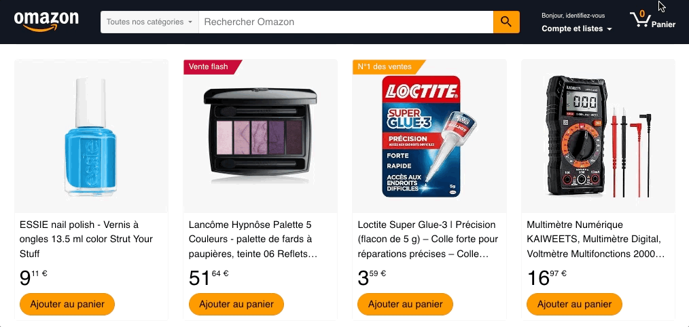
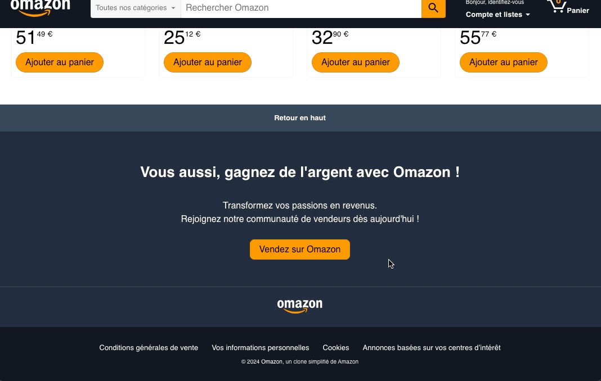

# Challenge 2 : `useState` pour gérer nos variables d'état

# 1. Panier

Objectif : Afficher le nombre de produits ajoutés dans le panier. Pour ça on va devoir stocker les identifiants de nos produits du panier dans un état partagé.

## 1.1 Création du state

On va créer un nouvel état `cartProducts` pour :

- avoir un tableau avec l’id des produits qui sont dans le panier
- au clic sur un bouton "Ajouter au panier" : ajouter l’id au tableau

Cet état est donc partagé entre :

- le headerMenu pour l’affichage (lecture)
- les cartes produit pour modifier l’état (écriture)

Tu dois donc trouver un ancêtre commun pour déclarer ton état : `<App />`.  
Utilise le hook `useState` pour créer ton état, initialise-le avec un tableau vide.

## 1.2 Diffusion et lecture du state pour afficher le nombre de produits dans le panier

On va avoir besoin d'afficher le nombre de produits dans le Menu.

Diffuse le tableau `cartProducts` jusqu'au sous-composant `<HeaderMenu />` via les props (depuis `<App />`, tu dois d'abord passer par `<Header />`)

Pense bien à typer les props avec TypeScript.

Utilise le tableau pour afficher le bon nombre de produits dans le panier.

## 1.3 Modification du state au click sur le bouton "Ajouter au panier"

On va avoir besoin de modifier la liste `cartProducts` à chaque clic sur un bouton "Ajouter au panier". Ce bouton est dans le composant `<ProductCard />` or notre state est dans `<App />`.
Tu dois faire passer via les props, depuis `<App />` jusqu'à `<ProductCard />`, une fonction qui ajoute un produit à la liste, 2 options :

- soit tu fais passer le setter du state directement
- soit tu fais passer une fonction qui utilise le setter du state pour ajouter un identifiant (reçu en paramètre) au tableau `cartProducts` (en respectant le principe d'immutabilité)

Dans le sous-composant `<ProductCard />`, place un écouteur d'évènement click sur le bouton "Ajouter au panier".
Dans le handler : tu peux ajouter l'identifiant à la liste du panier avec la fonction reçue en props.

# 2. Gestion des produits

On affiche les produits sur la home page, la liste de produits vient du fichier de data `products.ts` mais on va vouloir qu'elle évolue ! Si un vendeur ajoute un produit dans la liste il faut que le rendu se refasse pour afficher ce nouveau produit.

## 2.1 - Placer les produits dans le state

Place les produits dans le state du composant `<App />`. Utilise les data `products.ts` pour initialiser le state.

Diffuse cette liste de produits jusqu'au sous-composant `<Products />` et utilise-la au lieu de l'import des data.

## 2.2 - Création d'un formulaire d'ajout

Créé un nouveau composant `<ProductAddForm />` affichant une modale contenant un formulaire d'ajout de produit.

On considère que, potentiellement, la boîte modale pourrait être utilisée/appelée à plusieurs endroits avec un contenu différent… Donc créer un composant réutilisable serait une bonne idée !

Tu peux récupérer le code du composant d’UI `Modal.tsx` créé en cours et l'utiliser pour entourer ton formulaire.

## 2.3. Rendu conditionnel du formulaire

Le composant `<ProductAddForm />` sera affiché dans le Footer mais pas tout le temps, il va falloir ajouter un état qui définit la visibilité de ce composant.

- initialise un état qu'on peut appeler `displayModal` dans le bon composant
- utilise cet état pour faire un affichage conditionnel du formulaire
- au clic sur le bouton "Vendez sur Omazon", change la valeur de l'état à `true`
- au clic sur le bouton de fermeture de la modale, change la valeur de l'état à `false`

## 2.3 - Ajouter le produit à la validation du formulaire

Au submit du formulaire d'ajout tu dois récuperer les données des inputs pour créer un nouvel objet de type Product et l'ajouter dans le state.

- depuis App, diffuse le setter OU une fonction `addRental()` jusqu'au composant `<ProductAddForm />`
- ajoute un écouteur de submit
- dans le handler :
  - n'oublie pas le `preventDefault`
  - récupère les données des inputs (avec par exemple un FormData)
  - ajoute ce nouvel objet Produit au state grace à la callback reçue en props.

# 3. Liste de suggestions

Objectif : Ajouter un système de liste de suggestions sur le formulaire de recherche pour trouver des produits en fonction de la saisie utilisateur.

On a besoin de connaitre la valeur de l'input de recherche ainsi que de la select list des categories recherchées en temps réel car à chaque caractère tapé ou à chaque changement de catégorie : on va affiner la liste des produits proposés. On doit donc contrôler nos composants (input et select) !

## 3.1 Input controlé

### 3.1.1 Etat

Dans le composant qui contient l'input, créer un état local `searchTerm` pour stocker la valeur de l'input.

### 3.1.1 Controle en lecture

Il faut que l'utilisateur **lise la valeur du state** dans l'input, donc la value de l'input doit afficher la valeur du state.

### 3.1.1 Controle en écriture

Il faut que lorsque l'utilisateur saisisse un caractère dans l'input il **écrive dans le state**, ajoute un écouteur d'évènement "change" et dans le handler modifie la valeur du state.

## 3.2 Select liste controlée

Fais la même chose pour l'élement select, sa valeur doit être controlée par un emplacement de state `searchCategory`.

## 3.3 Tableau de suggestions de produits

Tu as besoin d'une liste de produits correspondant à la recherche, tu connais bien une fonction pour **filtrer le tableau** des produits !?

Utilise les 2 valeurs du state (`searchTerm` et `searchCategory`) pour créer cette liste filtrée.

## 3.3 Affichage conditionnel de la liste de suggestions

Afficher une dropdown liste de suggestions sous la recherche si le tableau n'est pas vide.

> Tu as le rendu de la dropdown sur la maquette figma.

Et voilà ! Plus tard on ajoutera un lien sur ces suggestions pour rediriger l'utilisateur vers la page produit.
