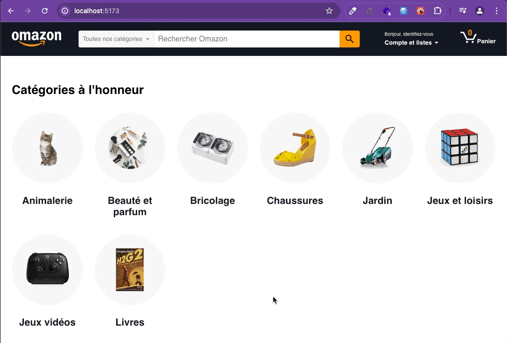

# Challenge 4 : routage et sécurité

## 1. Router

**Objectif : Au click sur un produit, afficher sur une url différente, une page produit avec les détails du produit.**

### 1.1 Mise en place du router

- Installe le package react-router-dom
- Créé ton router avec la fonction createBrowserRouter
- Diffuse ce router à tous tes composants avec le RouterProvider
- Mets en place le layout principal. Le composant App va devenir le layout principal (Root) et utilise le composant Outlet pour définir l'endroit ou injecter le contenu de chaque page.
- Mets en place la route principale, la HomePage va devenir la route index !
- Place les props du composant HomePage dans un context
- N'oublie pas de typer le context

### 1.2 Liens vers la page produit

- Dans le composant ProductCard, place un lien autour de l'image et du titre de chaque produit en les englobant d'un composant Link de react-router-dom, le lien renvoie vers la page `/product/xx` _(xx étant l'identifiant du produit)_

- Bonus : Tu peux aussi mettre des liens vers la page produits sur les items de la liste de suggestions (réalisée dans le challenge 2)

### 1.3 Route page produit

- Dans le router ajoute une route avec segment dynamique qui rend un nouveau composant `<ProductPage />`
- Utilise le hook useParams pour récuperer l'identifiant du produit à afficher
- Utilise le hook useRootContext pour récuperer la liste des produits
- Cherche le produit ayant l'id de celui de l'url dans la liste et affiche ses infos dans le JSX de `<ProductPage />`

### 1.4 Route page 404

- Ajoute une page erreur avec le propriété errorElement du browserRouter.
- Créé un composant ErrorPage qui affiche un message différent suivant le type d'erreur.

### 1.5 Loader

Tu constate peut-être que si tu arrive directement au premier rendu sur une page produit (par exemple le barbecue) sans passer par la HomePage, les produits n'ont pas encore été chargés donc le barbecue n'existe pas dans le state, il n'est pas trouvé et tu es redirigé vers la page erreur...

- Mets en place un loader à afficher à la place du barbecue tant que les produits ne sont pas encore arrivés dans le state !

### 1.6 Lien vers la page d'acceuil dans le Header

- Ajoute un lien autours du logo du header pour aller sur la page d'acceuil

## 2. Interpreter les balises html du code

**Objectif : Interpreter les balises html contenues dans le texte à l'affichage**

Il y a des balises `
` et `<strong>` dans la description des produits ainsi qu'une balise `` dans le tag "Choix d'Omazon".

- Utilise la prop `dangerouslySetInnerHTML` pour interpreter les balises du code.

- Attention aux failles XSS : le texte qui vient de la base de données contient peut être du code malveillant donc avant d'interpreter les balises qu'il contient, pense à nettoyer le code ;)

## 3. Bonus : page catégorie

**Objectif : Au click sur une catégorie , afficher sur une url différente, une page listant les produit de la catégorie.**

### 3.1. Liens vers la page categorie

- Dans le composant CategoryCard, place un lien autour de l'image et du titre de chaque categorie en les englobant d'un composant Link de react-router-dom, le lien renvoie vers la page `/category/categ-slug`

### 3.2. route paramétrée page catégorie

- Dans le router ajoute une route avec segment dynamique qui rend un nouveau composant `<CategoryPage />`

- Ce composant doit faire le rendu d'une liste de produits comme sur la page d'acceuil mais avec uniquement les produtis de la catégorie dont le slug est en paramètre de l'URL.

## 4. Bonus : variables d’environnement

**Objectif : Configurer le chemin d’accès à l’API dans les variables d’environnement**

- mets l’adresse de API du back dans un fichier d'environnement.
