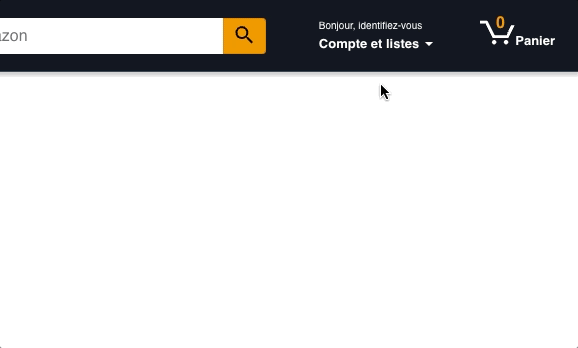
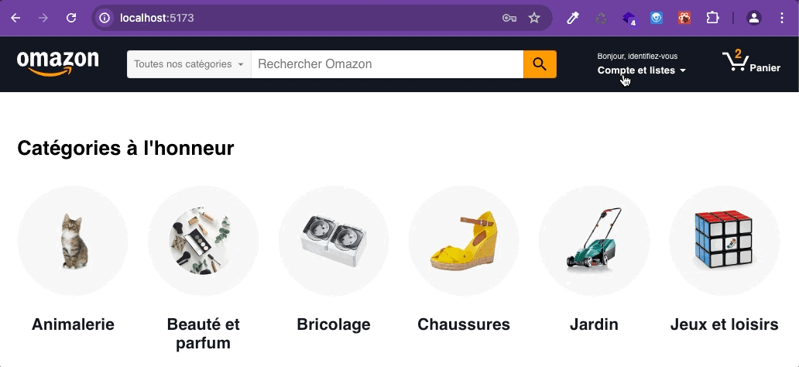

# Challenge 5 : authentification et autorisation

## 1. Authentification

**Objectif : Sauvegarder les données d'identification du user quand il se connecte**.

- Au submit du formulaire de login, envoie une requete de type POST (contenant l'email + mot de passe du user) vers le endpoint `/login` de l'API.

- Si tu reçois une 200, sauvegarde les infos reçues dans le state et affiche un message de connexion à la place du formulaire.

- Si tu reçois une erreur, affiche un message d'erreur.

## 2. Autorisation

**Objectif: Sur la page "panier", utiliser le JWT pour demander à l'API les produits du panier de l'utilisateur authentifié.**

- Ajoute une route "/cart" dans le browserRouter.
- Ajoute un lien dans le menu au click sur le logo panier vers cette nouvelle route pour afficher un nouveau composant `<CartPage>`
- Au montage de ce composant récupère les produits du panier depuis le endpoint de l'API `/cart` qui est un endpoint privé, il faudra donc bien ajouter le JWT dans les headers de ta requête !
- Attention, si l'utilisateur n'est pas connecté il ne faut pas lui afficher le panier mais le renvoyer vers la page d'acceuil.

## Bonus : Ajout des produits au panier

Pour l'instant quand on ajoute un produit au panier, son identifiant est ajouté dans une liste du state. Notre liste du state coté front n'est pas synchronisée avec notre liste de produits coté back.

**Objectif : Quand un utilisateur ajoute un produit au panier, on envoie l'info au back pour qu'il le stocke en BDD.**
